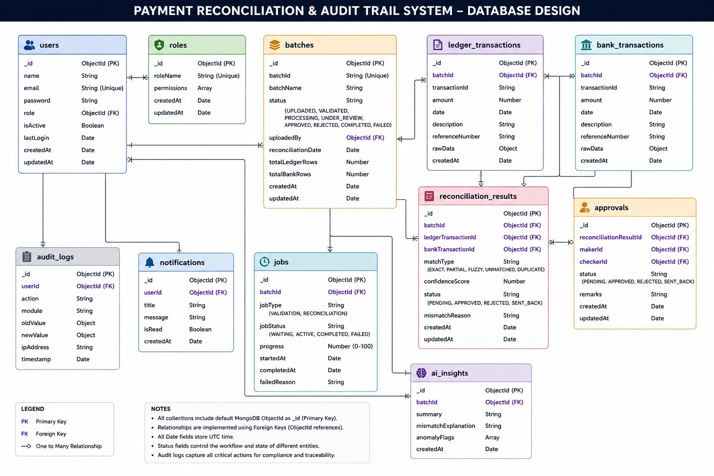

## User's DB design

users
│
├── role (MAKER | CHECKER | ADMIN)
│
└── batches
      │
      ├── transactions
      │      ├── source = LEDGER
      │      └── source = BANK
      │
      ├── match_results
      │
      ├── approvals
      │
      ├── ai_insights
      │
      └── jobs

audit_logs

notifications

(This database design is built around the **payment reconciliation process**. Users can log in with different roles such as **Maker**, **Checker**, or **Admin**, where Makers perform reconciliation tasks and Checkers verify and approve them. Every reconciliation activity is stored as a **batch**, which contains the uploaded transaction data from both the **internal ledger** and the **bank statement**, the reconciliation results showing whether transactions matched or had issues, approval records for the maker-checker workflow, AI-generated insights, and background processing job information. Alongside this, **audit logs** keep track of every important action performed in the system for transparency and compliance, while **notifications** are used to inform users about events such as completed reconciliations, approvals, or detected mismatches. Overall, the design helps organize reconciliation data, track user activities, and ensure that all actions are properly reviewed and recorded.)