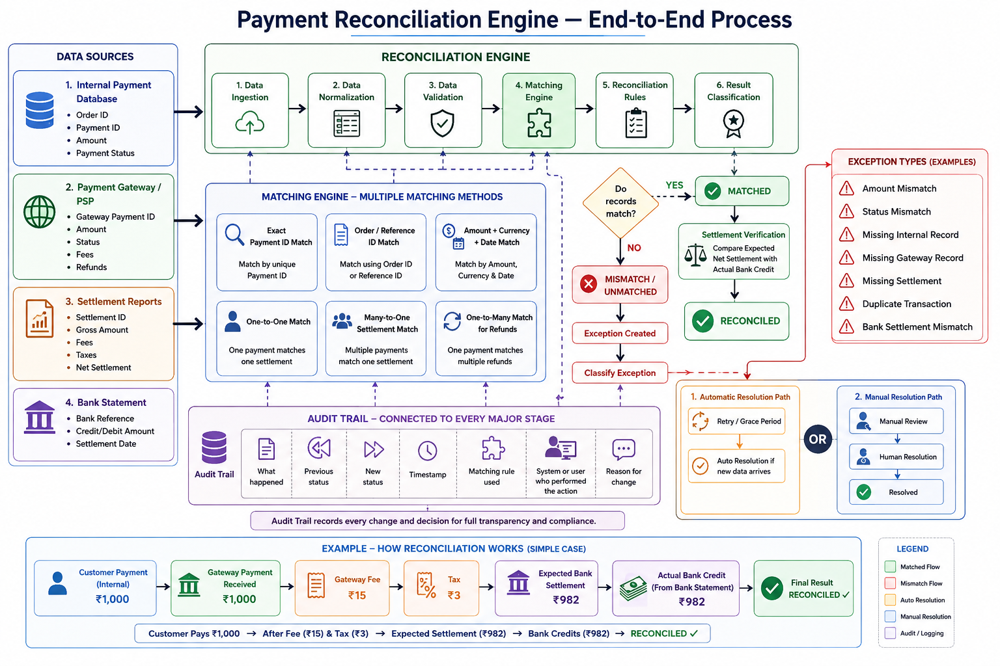

## 1. What is Payment Reconciliation?

Payment reconciliation is the process of checking:
> **"The customer paid money. Did the correct amount of money eventually reach our bank account?"**

A payment passes through multiple systems before the money reaches the company's bank account.

For example:

```text
Customer
   │
   │ Pays ₹1,000
   ▼
Our Application
   │
   ▼
Payment Gateway
   │
   │ Deducts Fee + Tax
   ▼
Settlement
   │
   ▼
Bank Account
```

Example:

```text
Customer Payment       ₹1,000
Gateway Fee              -₹15
Tax                       -₹3
                       -------
Expected Bank Amount      ₹982
```

If the bank actually receives:
```text
₹982
```
then everything is correct.

The payment/settlement is **RECONCILED**.

---

# 2. Why Do We Need a Reconciliation Engine?

Information about one payment exists in multiple systems.

The four main data sources are:
1. Internal Payment Database
2. Payment Gateway / PSP
3. Settlement Reports
4. Bank Statement

Each system knows a different part of the story.

```text
Internal Database ─────┐
                       │
Payment Gateway ───────┤
                       ├──→ Reconciliation Engine
Settlement Reports ────┤
                       │
Bank Statement ────────┘
```

The reconciliation engine combines information from these systems and checks whether everything agrees.

---

# 3. Internal Payment Database

This is **our company's own record of the payment**.

For example:

```text
Order ID:       ORDER-100
Payment ID:     PAY-123
Amount:         ₹1,000
Status:         SUCCESS
```

Our system is basically saying:
> "According to me, customer successfully paid ₹1,000."

But this is only our version of the story.
We still need to compare it with the payment gateway.

---

# 4. Payment Gateway / PSP

A Payment Gateway or PSP (Payment Service Provider) processes the customer's payment.
(a digital cashier between the customer, the business and the bank)

For example:

```text
Payment ID:     PAY-123
Amount:         ₹1,000
Status:         SUCCESS
Fee:            ₹15
Tax:            ₹3
```

Now we can compare:

```text
Our System              Gateway

PAY-123                 PAY-123
₹1,000       ← MATCH →  ₹1,000
SUCCESS                 SUCCESS
```

Both systems agree.

But we still need to know whether the correct money reached our bank.

---

# 5. What is a Settlement?

A payment gateway may not send every customer payment separately to our bank.

Suppose three customers pay:

```text
Customer A → ₹1,000
Customer B → ₹2,000
Customer C → ₹3,000

Total = ₹6,000
```

The gateway may combine these payments together.
This is called a **settlement**.

For example:

```text
Total Payments            ₹6,000
Gateway Fees                -₹90
Tax                         -₹16
                          -------
Net Settlement            ₹5,894
```

The gateway sends:

```text
₹5,894
```

to our bank account.

Therefore:
> **Settlement = Money transferred by the payment provider to the merchant after adjustments such as fees and taxes.**

---

# 6. Settlement Report

The settlement report explains how the gateway calculated the money sent to us.

For example:

```text
Settlement ID: SET-500

Gross Amount:     ₹6,000
Gateway Fees:       -₹90
Tax:                -₹16
                  -------
Net Settlement:   ₹5,894
```

It may also contain information about which payments are included in the settlement.

For example:

```text
PAY-001 ₹1,000 ─┐
                 │
PAY-002 ₹2,000 ─┼──→ Settlement SET-500
                 │
PAY-003 ₹3,000 ─┘
```

---

# 7. Bank Statement

The bank statement tells us how much money **actually reached our bank account**.

For example:

```text
Settlement Reference: SET-500

Credit Amount: ₹5,894
```

Now we can compare:

```text
Expected Settlement = ₹5,894

Actual Bank Credit  = ₹5,894

MATCH ✓
```

Everything is correct.

---

# 8. Complete Payment Journey

The complete journey looks like this:

```text
CUSTOMER
   │
   │ Pays ₹1,000
   ▼
OUR APPLICATION
   │
   │ Records Payment
   ▼
PAYMENT GATEWAY
   │
   │ Processes Payment
   │
   │ Deducts Fee + Tax
   ▼
SETTLEMENT
   │
   │ Calculates Expected Amount
   ▼
BANK
   │
   │ Receives Actual Money
   ▼
RECONCILIATION ENGINE
   │
   │ Compares Everything
   ▼
RECONCILED / EXCEPTION
```

---

# 9. What Does the Reconciliation Engine Do?

The reconciliation engine performs approximately these steps:

```text
1. Data Ingestion
       ↓
2. Data Normalization
       ↓
3. Data Validation
       ↓
4. Matching
       ↓
5. Reconciliation Rules
       ↓
6. Result Classification
       ↓
7. Settlement Verification
       ↓
8. Exception Handling
       ↓
9. Audit Trail
```

---

# 10. Step 1 — Data Ingestion

**Data ingestion simply means collecting data from different systems.**

The engine collects information from:

```text
Internal Database ─────┐
                       │
Payment Gateway ───────┤
                       ├──→ Reconciliation System
Settlement Report ─────┤
                       │
Bank Statement ────────┘
```

Data may come from:
- APIs
- CSV files
- Database queries
- Webhooks
- Bank files

The goal is simply:
> **"Bring all the required information into our reconciliation system."**

---

# 11. Step 2 — Data Normalization

Different systems may represent the same information differently.

Example:

Our system:

```text
Amount = ₹1,000
```

Gateway:

```text
Amount = 100000 paise
```

Bank:

```text
Amount = 1000.00 INR
```

All three mean the same thing.

Similarly, payment statuses may be different:

```text
Our System: SUCCESS

Gateway: CAPTURED

Bank: CREDITED
```

The reconciliation engine converts everything into a **common internal format**.

For example:

```text
Amount:   1000.00
Currency: INR
Status:   SUCCESS
```

Therefore:

> **Normalization = converting data from different systems into one standard format.**

Think of it like translating different languages into one common language.

---

# 12. Step 3 — Data Validation

Before matching transactions, the engine checks whether the data is valid.

For example:

```text
Does Payment ID exist?       ✓

Does Amount exist?           ✓

Is Amount valid?             ✓

Is Currency valid?           ✓

Is Date valid?               ✓

Is this a duplicate?         ✓
```

Bad example:

```text
Payment ID: Missing
Amount: ???
Date: Missing
```

The engine should not blindly process this record.

Therefore:

> **Validation = checking whether the incoming data is complete and usable.**

---

# 13. Step 4 — Matching Engine

The Matching Engine is one of the most important parts of the system.

It answers:

> **"Which records from different systems belong to the same real-world transaction?"**

Example:

Internal database:

```text
Payment ID: PAY-123
Amount: ₹1,000
```

Gateway:

```text
Payment ID: PAY-123
Amount: ₹1,000
```

The engine determines:

```text
Internal PAY-123
        ↕
Gateway PAY-123
```

These records represent the same payment.

---

# 14. Matching Method 1 — Exact Payment ID

This is the easiest and safest method.

Internal:

```text
Payment ID = PAY-123
```

Gateway:

```text
Payment ID = PAY-123
```

Therefore:

```text
PAY-123 = PAY-123

MATCH ✓
```

---

# 15. Matching Method 2 — Order / Reference ID

Sometimes Payment ID may not be available.

But both systems may contain:

```text
Order ID = ORDER-500
```

Then:

```text
Internal
ORDER-500
    ↕
Gateway
ORDER-500
```

The engine can match using the Order ID or Reference ID.

---

# 16. Matching Method 3 — Amount + Currency + Date

Sometimes a common ID isn't available.

Then multiple fields may be used.

For example:

```text
Internal:

Amount   = ₹1,000
Currency = INR
Date     = 31 July
```

Gateway:

```text
Amount   = ₹1,000
Currency = INR
Date     = 31 July
```

These records may belong together.

However, this matching rule must be used carefully because multiple customers could pay the same amount on the same day.

---

# 17. One-to-One Matching

One internal payment matches one gateway transaction.

```text
Internal Payment
PAY-123
₹1,000

     ↕

Gateway Payment
PAY-123
₹1,000
```

This is:

```text
ONE → ONE
```

---

# 18. Many-to-One Matching

Multiple customer payments may be combined into one settlement.

Example:

```text
Payment A ₹1,000 ─┐
                   │
Payment B ₹2,000 ─┼──→ Settlement SET-500
                   │
Payment C ₹3,000 ─┘
```

This is:

```text
MANY PAYMENTS → ONE SETTLEMENT
```

This is very common in payment systems.

---

# 19. One-to-Many Matching

One payment may have multiple related transactions.

Refunds are a good example.

Customer originally pays:

```text
₹1,000
```

Later:

```text
Refund 1 = ₹200
Refund 2 = ₹300
```

Relationship:

```text
          Payment ₹1,000
               │
        ┌──────┴──────┐
        ▼             ▼
   Refund ₹200    Refund ₹300
```

This is:

```text
ONE PAYMENT → MANY REFUNDS
```

---

# 20. Matching vs Reconciliation

This distinction is very important.

## Matching

Matching asks:

> **"Do these records belong to the same transaction?"**

Example:

```text
Internal PAY-123
        ↕
Gateway PAY-123

MATCH ✓
```

## Reconciliation

Reconciliation asks:

> **"Now that we know they belong together, do their financial details agree?"**

Example:

```text
Internal Amount = ₹1,000

Gateway Amount  = ₹1,000

MATCH ✓
```

Later:

```text
Expected Bank Settlement = ₹982

Actual Bank Credit       = ₹982

MATCH ✓
```

---

# 21. Reconciliation Rules

After records are matched, the engine checks important fields.

For example:

```text
Payment ID     → Does it match?

Amount         → Does it match?

Currency       → Does it match?

Payment Status → Does it match?

Settlement     → Does it match?

Bank Amount    → Does it match?
```

If everything agrees:

```text
MATCHED
```

If something does not agree:

```text
MISMATCH / UNMATCHED
```

---

# 22. The Main Decision

The engine essentially asks:

```text
             Do records match?
                    │
              ┌─────┴─────┐
              │           │
             YES          NO
              │           │
              ▼           ▼
           MATCHED     MISMATCH
```

---

# 23. What Happens When Records Match?

Suppose:

```text
Internal Payment = ₹1,000

Gateway Payment  = ₹1,000
```

Result:

```text
MATCHED ✓
```

But the process is not completely finished.

We still need to verify the settlement.

---

# 24. Settlement Verification

Suppose:

```text
Customer Payment       ₹1,000

Gateway Fee              -₹15

Tax                       -₹3
                       -------
Expected Settlement       ₹982
```

The reconciliation engine calculates:

```text
Expected Bank Amount = ₹982
```

Now check the bank statement.

Bank says:

```text
Actual Bank Credit = ₹982
```

Compare:

```text
Expected = ₹982
Actual   = ₹982

MATCH ✓
```

Final result:

```text
RECONCILED ✓
```

Therefore:

> **RECONCILED means we checked the payment and settlement, and the money makes sense.**

---

# 25. What Happens When Something Doesn't Match?

Example:

```text
Expected Bank Amount = ₹982

Actual Bank Amount   = ₹900
```

Difference:

```text
₹982 - ₹900 = ₹82
```

Something is wrong.

The engine marks it as:

```text
MISMATCH / UNMATCHED
```

Then it creates an **exception**.

---

# 26. What is an Exception?

An exception simply means:

> **"Something looks wrong and needs attention."**

Example:

```text
Exception Type: Amount Mismatch

Expected Amount: ₹982

Actual Amount:   ₹900

Difference:      ₹82
```

---

# 27. Common Exception Types

## Amount Mismatch

```text
Internal = ₹1,000
Gateway  = ₹900
```

---

## Status Mismatch

```text
Internal = SUCCESS
Gateway  = FAILED
```

---

## Missing Gateway Record

```text
Internal:

PAY-123 exists

Gateway:

PAY-123 NOT FOUND
```

---

## Missing Internal Record

```text
Gateway:

PAY-999 exists

Internal Database:

PAY-999 NOT FOUND
```

---

## Missing Settlement

Payment exists, but the expected settlement record cannot be found.

---

## Duplicate Transaction

The same transaction appears more times than expected.

```text
PAY-123
PAY-123
```

---

## Bank Settlement Mismatch

```text
Expected Bank Credit = ₹982

Actual Bank Credit   = ₹950
```

---

# 28. Exception Resolution

Once an exception is created, there are generally two paths:

```text
                    EXCEPTION
                        │
              ┌─────────┴─────────┐
              │                   │
              ▼                   ▼
     Automatic Resolution    Manual Resolution
```

---

# 29. Automatic Resolution

Sometimes nothing is actually wrong.

The data may simply arrive late.

Example:

At 10:00:

```text
Internal Database:

PAY-123 = SUCCESS
```

At 10:01:

```text
Gateway:

PAY-123 = NOT FOUND
```

The engine creates:

```text
Missing Gateway Record
```

But instead of immediately asking a human to investigate, it waits.

```text
Wait
  ↓
Retry
  ↓
Gateway data arrives
  ↓
PAY-123 found
  ↓
MATCHED
  ↓
Exception automatically resolved
```

This waiting time is often called a:

- Grace Period
- Retry Period
- Aging Window

---

# 30. Manual Resolution

Sometimes retrying does not solve the problem.

Example:

```text
Expected Settlement = ₹50,000

Actual Bank Credit  = ₹45,000

Difference          = ₹5,000
```

A human may need to investigate.

```text
Exception
    ↓
Manual Review
    ↓
Employee Investigates
    ↓
Find Reason
    ↓
Human Resolution
    ↓
RESOLVED
```

---

# 31. Audit Trail

The Audit Trail is one of the most important parts of a reconciliation system.

It stores:

> **The history of everything that happened to a transaction or reconciliation.**

Example:

```text
10:00
Payment PAY-123 imported

10:01
Reconciliation started

10:01
Gateway record not found

10:01
Exception created

10:06
Automatic retry started

10:06
Gateway record found

10:06
Payment matched

10:07
Settlement verified

10:07
Exception automatically resolved

10:07
Final Status = RECONCILED
```

The system keeps this entire history.

---

# 32. Why Do We Need an Audit Trail?

Imagine someone asks:

> "Why was PAY-123 marked UNMATCHED yesterday but is RECONCILED today?"

Without an audit trail, the database may only show:

```text
PAY-123

Status = RECONCILED
```

We don't know how it reached that state.

With an audit trail:

```text
PAY-123

10:01 → UNMATCHED

Reason:
Gateway record missing

10:01 → Exception created

10:06 → Automatic retry

10:06 → Gateway record found

10:07 → MATCHED

10:07 → Exception resolved

10:07 → RECONCILED
```

Now we know exactly what happened.

---

# 33. What Should the Audit Trail Store?

For every important change, we should know:

```text
WHAT happened?

WHEN did it happen?

WHAT was the previous status?

WHAT is the new status?

WHICH matching rule was used?

WHO performed the action?

WHY did the change happen?
```

Example:

```text
Payment ID:
PAY-123

Action:
Reconciliation Status Changed

Previous Status:
UNMATCHED

New Status:
MATCHED

Matching Rule:
Exact Payment ID Match

Performed By:
Reconciliation Engine

Reason:
Gateway data became available

Time:
10:06 AM
```

---

# 34. Full Simple Example

Customer pays:

```text
₹1,000
```

Our system records:

```text
Payment ID = PAY-123
Amount = ₹1,000
Status = SUCCESS
```

Gateway says:

```text
Payment ID = PAY-123
Amount = ₹1,000
Status = SUCCESS
```

Matching:

```text
PAY-123 = PAY-123

MATCH ✓
```

Amount comparison:

```text
₹1,000 = ₹1,000

MATCH ✓
```

Gateway charges:

```text
Payment      ₹1,000
Fee            -₹15
Tax             -₹3
             -------
Expected        ₹982
```

Bank statement:

```text
Actual Bank Credit = ₹982
```

Comparison:

```text
Expected = ₹982

Actual   = ₹982

MATCH ✓
```

Final result:

```text
RECONCILED ✓
```

---

# 35. The Entire System in One Flow

```text
CUSTOMER PAYS
      │
      ▼
INTERNAL PAYMENT CREATED
      │
      ▼
PAYMENT GATEWAY PROCESSES PAYMENT
      │
      ▼
COLLECT DATA
      │
      ▼
NORMALIZE DATA
      │
      ▼
VALIDATE DATA
      │
      ▼
MATCH RECORDS
      │
      ▼
DO VALUES MATCH?
      │
   ┌──┴──┐
   │     │
  YES    NO
   │     │
   ▼     ▼
MATCHED  EXCEPTION
   │        │
   │     ┌──┴────────────┐
   │     │               │
   │   RETRY         MANUAL REVIEW
   │     │               │
   │     └──────┬────────┘
   │            ▼
   │         RESOLVED
   │
   ▼
VERIFY SETTLEMENT
   │
   ▼
COMPARE EXPECTED BANK AMOUNT
WITH ACTUAL BANK AMOUNT
   │
   ▼
RECONCILED ✓
```

During the entire process:

```text
          AUDIT TRAIL
               │
               ▼
Records every important event,
decision, status change and reason
```

---

# 36. Three Most Important Concepts

If I remember nothing else, I should remember these three concepts.

## 1. Matching

Question:

> **"Are these records talking about the same transaction?"**

Example:

```text
Internal PAY-123
        ↕
Gateway PAY-123
```

---

## 2. Reconciliation

Question:

> **"Now that I know they are the same transaction, does the money/status make sense?"**

Example:

```text
Internal Amount = ₹1,000

Gateway Amount  = ₹1,000

MATCH ✓
```

Then:

```text
Expected Bank Amount = ₹982

Actual Bank Amount   = ₹982

MATCH ✓
```

---

## 3. Audit Trail

Question:

> **"Can I prove exactly what happened?"**

Example:

```text
10:01 → Payment checked

10:01 → Mismatch found

10:01 → Exception created

10:06 → Retried

10:06 → Payment matched

10:07 → Settlement verified

10:07 → Reconciled
```

---

# 37. Easy Way to Remember the Whole System

Think of the **Reconciliation Engine as an accountant robot**.

The robot asks:

```text
1. What does OUR SYSTEM say?

2. What does the PAYMENT GATEWAY say?

3. What does the SETTLEMENT REPORT say?

4. What does the BANK say?

5. Are they talking about the SAME transactions?

6. Do the AMOUNTS and STATUSES agree?

7. Did the CORRECT MONEY reach our bank?

8. If something is wrong, create an EXCEPTION.

9. Try to automatically resolve it.

10. If necessary, ask a HUMAN to investigate.

11. Record EVERYTHING in the AUDIT TRAIL.
```

The main goal is:

> **All systems should tell the same financial story.**

If they do:

```text
RECONCILED ✓
```

If they don't:

```text
EXCEPTION ⚠
```

---

# Final Mental Model

```text
PAYMENT
   │
   ▼
MATCHING
"Are these records for the same transaction?"
   │
   ▼
RECONCILIATION
"Do the amounts and statuses agree?"
   │
   ▼
SETTLEMENT VERIFICATION
"Did the correct money reach the bank?"
   │
   ├───────────────┐
   ▼               ▼
CORRECT          INCORRECT
   │               │
   ▼               ▼
RECONCILED      EXCEPTION
                   │
              ┌────┴────┐
              ▼         ▼
            RETRY     HUMAN
              │         │
              └────┬────┘
                   ▼
                RESOLVED

AUDIT TRAIL:
Records everything that happened throughout this process.
```

## One-Line Summary

> **Payment Reconciliation Engine = A system that collects payment data from multiple sources, finds records belonging to the same transactions, checks whether the financial details match, verifies that the correct money reached the bank, handles mismatches, and records every action in an audit trail.**